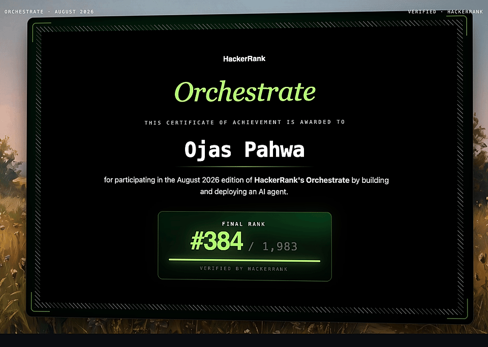

# HackerRank Orchestrate

My projects from HackerRank Orchestrate, a 24-hour AI agent hackathon. Each
project has its own folder with its own code, data and README.

| folder | challenge | month | rank |
|---|---|---|---|
| [`buy-or-wait/`](./buy-or-wait) | Buy or Wait? | September 2026 | **63 of 3,062** |
| [`whatsapp-notification-router/`](./whatsapp-notification-router) | WhatsApp Message Notification Router | August 2026 | **384 of 1,983** |

- **Buy or Wait?** looks at a user's money over the next 90 days and decides
  if they should pay in full, pay in parts, use installments, wait, or not buy.
- **WhatsApp Notification Router** reads each message (text, voice note or
  image) and decides whether to notify the user now, save it for later, or
  hide it.

## Certificate (August 2026)



## Run a project

Go into its folder and follow its README. For example:

```bash
cd buy-or-wait
pip install -r requirements.txt
python -m src.cli
```

API keys are read from environment variables and are never committed.
