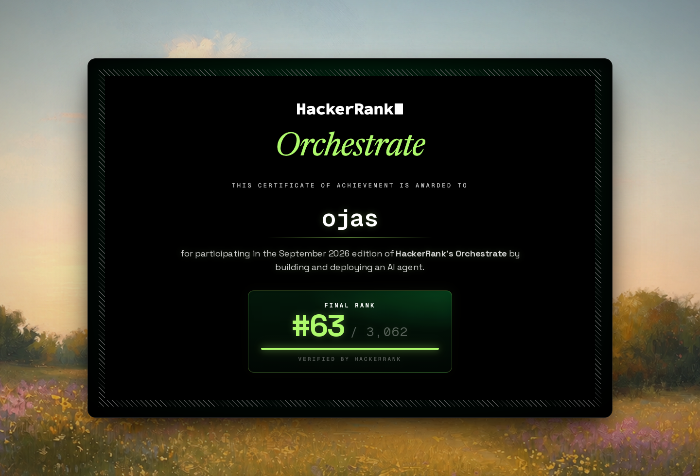

# Buy or Wait?

My submission for HackerRank Orchestrate, September 2026.

**Rank: 63 out of 3,062.**



## What it does

A user wants to buy something. This program looks at their money and tells
them what to do: pay in full, pay part now, pay in installments, wait, or
don't buy.

For each of the 250 requests in `dataset/requests.csv` it:

1. Works out the user's bank balance for the next 90 days, using their
   salary, bills, pending payments and currency rates.
2. Finds how much they can pay today without going below the minimum balance
   they want to keep.
3. Checks the payment options the seller offers and the ones the user accepts.
4. Picks the best plan and writes it to `output.csv`, with a short reason.

## How AI is used

AI only reads things a person would read:

- **Bill and payslip images**, to find amounts missing from the data (Gemini).
- **Messages**, like "your salary is stopping", to update the user's income
  (Groq).

The AI never makes the decision. Plain Python code makes every decision. The
AI's answer is checked before it is used, and if the check fails it is ignored.
Text inside a message can't change the result, even if it tries.

## Run it

Needs Python 3.11 or newer.

```bash
pip install -r requirements.txt
python -m src.cli
```

This writes `output.csv`. It works without any API key.

To also read images and messages with AI, set your keys first:

```bash
export GEMINI_API_KEY=...
export GROQ_API_KEY=...
python -m src.cli --use-model
```

Past AI results are saved in `artifacts/`, so a re-run doesn't call the AI again.

## Test it

```bash
python -m pytest -q                # unit tests, no API key needed
python -m evaluation.score         # compare with the 25 sample answers
```

## Folders

| folder | what's inside |
|---|---|
| `src/` | the program |
| `tests/` | unit tests |
| `evaluation/` | scoring scripts and the token usage report |
| `dataset/` | input data from the challenge |
| `artifacts/` | saved AI results |

More detail on the design choices is in [`DECISIONS.md`](./DECISIONS.md).
